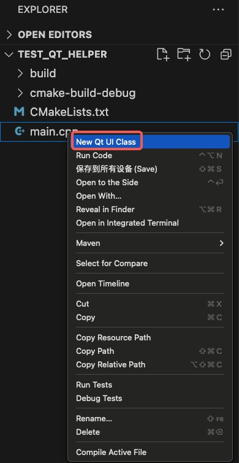

# qt-helper for visual studio code

Develop Qt applications with Visual Studio Code.This is a plugin similar to clion new qt ui class.

## Features

  - new qt ui class files
	  - cpp header file (.h)
	  - cpp class file (.cpp)
	  - qt designer form file (.ui)
- insert generated files to CMakelists.txt
  

## How to

Right-click in the file management area and select New Qt UI Class.